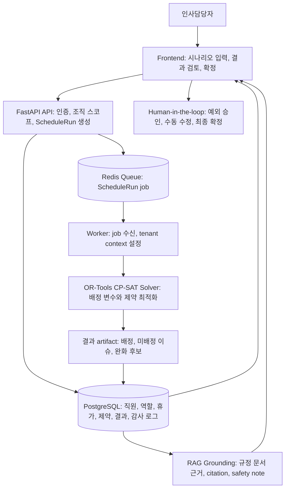

# WorkScheduleAI

WorkScheduleAI는 인사담당자가 직원, 역할, 휴가, 직원 간 조합 제한, 근무 규정을 입력하면 근무표 후보를 자동 생성하고, 충돌 사유와 규정 근거를 함께 검토하도록 돕는 AI 근무표 작성 시스템입니다.

현재 제출 기준의 정확한 상태는 "상용 완제품"이 아니라 "파일럿 운영 가능한 수준의 운영 검증용 시스템"입니다. 근무표를 완전 자동 확정하지 않고, 인사담당자가 검토, 예외 승인, 수동 수정, 최종 확정을 수행하는 human-in-the-loop 구조를 전제로 합니다.

## 프로젝트 개요

이 저장소는 근무표 자동 생성, 제약 충돌 설명, RAG 기반 근거 제시, 수동 검토와 확정 흐름을 하나의 파일럿 시스템으로 묶은 프로젝트입니다. Backend는 근무표 생성과 데이터 영속성을 담당하고, worker는 solver 실행을 담당하며, frontend는 인사담당자가 입력, 검토, 승인, 확정을 수행하는 운영 화면을 제공합니다.

## 문제 정의

근무표 작성은 단순히 빈 칸을 채우는 작업이 아닙니다. 실제 현장에서는 다음 조건이 동시에 충돌합니다.

- 직원별 역할 가능 여부
- 휴가, 출장, 교육, 개인 일정
- 함께 배치하면 안 되거나 피해야 하는 직원 조합
- 역할별 필요 인원과 근무 유형
- 주간 근무 상한, 연속 근무, 최소 휴식, 야간/주말 운영 검토
- 미배정 발생 시 어떤 예외를 승인할 수 있는지에 대한 설명 책임

이 프로젝트는 이런 조건을 구조화된 데이터와 제약 최적화로 반영하고, RAG 기반 근거와 사람이 읽기 쉬운 설명을 붙여 인사담당자의 검토 시간을 줄이는 것을 목표로 합니다.

## 비용 대비 가치

이 프로젝트의 설득 포인트는 "토큰을 써서 근무표를 만든다"가 아닙니다. 근무표 계산은 OR-Tools CP-SAT가 수행하므로 기본 생성 경로는 LLM 토큰에 의존하지 않습니다. LLM/RAG는 인사담당자가 충돌 사유, 예외 후보, 사내 규정 근거를 이해해야 하는 구간에만 제한적으로 쓰는 보조 계층입니다.

인사담당자와 회사 대표 입장에서 더 큰 비용은 토큰 자체보다 근무표 작성과 수정에 들어가는 사람의 시간, 휴가 반영 누락, 상극 조합 누락, 불공정 배정 논란, 예외 판단 기록 부재입니다. WorkScheduleAI는 이 비용을 줄이기 위해 다음 가치를 제공합니다.

- 반복적인 Excel 작성과 재검토 시간을 줄입니다.
- 휴가, 역할, 상극, 근무 규정을 한 번에 반영해 누락 위험을 낮춥니다.
- 미배정과 예외 후보를 숨기지 않고 검토 항목으로 남깁니다.
- RAG 근거로 인사담당자가 "왜 이 판단이 나왔는지"를 설명하기 쉽게 만듭니다.
- 확정본, 수동 수정, 예외 승인, audit log를 남겨 운영 책임 소재를 분명히 합니다.

토큰 비용은 전체 근무표 생성 비용이 아니라 검토와 설명 시간을 줄이는 제한적 비용으로 보는 것이 맞습니다. 후속 운영 단계에서는 조직별 LLM 호출 수, token usage, estimated cost, 월간 사용 한도, cache 적용 여부를 기록해 비용 통제까지 붙이는 것이 좋습니다.

## 핵심 기능

- 조직, 직원, 역할, 역할 적격성 관리
- 휴가, 출장, 교육, 개인 일정 등 근무 불가 일정 관리
- 직원 간 `blocked`, `avoid`, `prefer` 조합 제약 관리
- 근무 유형, 역할별 필요 인원, 요일 적용 범위 설정
- OR-Tools CP-SAT 기반 근무표 생성
- Redis queue 기반 비동기 ScheduleRun worker 처리
- 미배정, 충돌, 완화 후보를 `ScheduleIssue`와 `RelaxationProposal`로 노출
- 예외 승인 후 최대 재계산 라운드 관리
- 수동 배정 검증과 저장
- 확정본 `SchedulePublication` 생성, 읽기 전용 잠금, Excel 다운로드
- RAG 문서 ingest/list/delete/query와 관리자용 "판단 근거" 표시
- prompt injection chunk drop, PII redaction, solver/policy non-mutation guardrail
- 감사 로그, 운영 readiness, metrics, CSV export
- `.xlsx`/CSV/TSV 가져오기 미리보기와 적용
- signed actor token 기반 관리자 세션과 직원별 signed publication link

## 아키텍처 개요

```text
Frontend (React/Vite)
  -> FastAPI API service
      -> PostgreSQL: tenant data, schedule snapshots, publications, audit logs, RAG docs
      -> Redis: schedule-run job queue and processing lease metadata
      -> OR-Tools worker: schedule generation and recalculation
      -> RAG grounding layer: retrieved evidence, redaction, safety notes
```

서비스를 API, worker, frontend로 분리한 이유는 solver 실행이 CPU와 시간이 걸리는 작업이기 때문입니다. API 요청 경로는 빠르게 ScheduleRun을 만들고 queue에 넣으며, worker가 별도 프로세스에서 실행 결과를 저장합니다. 이 방식은 Railway에서 API/worker/PostgreSQL/Redis를 분리 배포하기에 맞고, stale worker나 queue lease 문제도 운영 체크리스트에서 다룹니다.

### 아키텍처 흐름도



### Solver와 OR-Tools CP-SAT는 무엇인가

여기서 solver는 근무표를 "AI가 문장으로 만들어내는 기능"이 아니라, 가능한 배정 조합 중 조건을 가장 잘 만족하는 조합을 찾는 최적화 엔진입니다. 예를 들어 "직원 E001이 2026-07-01 주간 근무의 사수 역할에 들어가는가"를 참/거짓 변수로 두고, 휴가자는 제외하고, 같은 슬롯에 한 직원을 중복 배정하지 않고, 상극 직원은 같이 넣지 않는 식으로 제약을 겁니다.

OR-Tools CP-SAT는 Google OR-Tools의 constraint programming solver입니다. CP-SAT는 정수와 불리언 변수 기반으로 제약을 만족하는 해를 찾고, 필요하면 penalty가 가장 작은 해를 고릅니다. 이 프로젝트에서는 CP-SAT가 최종 판단자가 아니라 후보 배정과 충돌 진단을 만드는 계산 엔진이며, 인사담당자가 결과를 검토하고 확정합니다.

### 왜 OR-Tools CP-SAT를 선택했나

근무표 생성은 직원, 날짜, 근무 슬롯, 역할의 조합을 고르는 이산 최적화 문제입니다. 각 배정은 참/거짓 변수로 표현하기 쉽고, 휴가자 제외, 역할 적격성, 같은 슬롯 중복 배정 금지, 상극 조합 금지처럼 명확한 제약이 많습니다. OR-Tools CP-SAT는 이런 불리언/정수 변수와 제약, penalty objective를 한 모델에 담기 적합했습니다.

이 판단 때문에 순수 LLM으로 근무표를 만들지 않았습니다. LLM은 설명과 요약에는 유용하지만, 모든 제약을 빠짐없이 지켰는지 검증하기 어렵고 같은 입력에서 같은 결과를 낸다는 보장도 약합니다. 단순 greedy rule engine은 구현은 쉽지만, 휴가, 상극, 공정성, 미배정 penalty가 동시에 걸릴 때 대안 탐색이 약합니다. CP-SAT는 제한 시간, seed, objective score, feasible/optimal 상태를 명시적으로 다루므로 제출 시연과 파일럿 검증에서 선택 근거가 더 분명했습니다.

CP-SAT에도 한계가 있습니다. 제약이 많고 기간이 길어질수록 탐색 시간이 늘어납니다. 이 프로젝트는 생성 기간, timeout, worker 분리, 미배정 이슈 노출, 인사담당자 검토를 함께 둔 파일럿 구조로 설계했습니다.

## 주요 기술 스택

- Backend: Python 3.13, FastAPI, SQLAlchemy, Alembic
- Solver: Google OR-Tools CP-SAT
- Queue: Redis list + processing lease metadata
- Database: PostgreSQL for deployment, SQLite fallback for local development
- Frontend: React, TypeScript, Vite
- Deployment: Railway API service, worker service, frontend service, PostgreSQL, Redis
- Testing: pytest, Node test runner, TypeScript build, Vite build

## 실행 방법

Backend:

```powershell
python -m venv .venv
.\.venv\Scripts\Activate.ps1
python -m pip install -e ".[dev]"
python -m alembic upgrade head
python -m scripts.seed_demo
python -m uvicorn work_schedule_ai.api.app:create_app --factory --host 127.0.0.1 --port 8000 --reload
```

Worker:

```powershell
python -m work_schedule_ai.worker.queue_worker
```

로컬에서 `REDIS_URL`이 없으면 in-memory queue fallback을 사용합니다. 실제 API/worker 분리 동작을 확인하려면 Redis를 띄우고 `REDIS_URL`을 설정해야 합니다.

Frontend:

```powershell
cd frontend
npm install
$env:VITE_API_BASE_URL='http://127.0.0.1:8000'
npm run dev
```

## Railway 배포 구성

권장 Railway 구성은 5개 서비스입니다.

- API service: repository root, `railway.json`, Dockerfile build
- Worker service: repository root, `railway.worker.json` 또는 동일 start command 수동 설정
- Frontend service: `frontend`, `frontend/railway.json`, Railpack build
- PostgreSQL service: 운영 데이터 저장
- Redis service: ScheduleRun queue

API start command:

```powershell
python -m uvicorn work_schedule_ai.api.app:create_app --factory --host 0.0.0.0 --port ${PORT:-8000}
```

Worker start command:

```powershell
python -m work_schedule_ai.worker.queue_worker
```

Frontend start command:

```powershell
npx vite preview --host 0.0.0.0 --port ${PORT:-4173}
```

API healthcheck path는 `/health/ready`입니다. Railway의 최신 배포 상태는 각 서비스의 최신 deployment가 `Active`인지, API `/health/version`의 commit과 worker 로그 첫 줄의 `git_commit`이 같은지, 그리고 frontend가 올바른 API URL을 바라보는지로 확인합니다.

상세 절차는 `docs/deployment/railway.md`를 참고하세요.

## 환경변수 목록

### API service

| Name | Required | Notes |
| --- | --- | --- |
| `APP_ENV` | production required | `production`이면 운영 fail-closed 검증이 활성화됩니다. |
| `DATABASE_URL` | production required | production에서는 PostgreSQL URL이어야 합니다. |
| `REDIS_URL` | production required | ScheduleRun enqueue에 사용합니다. |
| `CORS_ALLOW_ORIGINS` | deployment required | 배포된 frontend origin을 지정합니다. |
| `WORKSCHEDULEAI_AUTH_REQUIRED` | production required | production에서는 `1`이어야 합니다. |
| `WORKSCHEDULEAI_SIGNED_ACTOR_SECRET` | production required | 32자 이상. 관리자 signed actor token에 사용합니다. |
| `WORKSCHEDULEAI_EMPLOYEE_LINK_SECRET` | production required for API | 32자 이상. 직원 signed publication link에 사용합니다. |

### Worker service

| Name | Required | Notes |
| --- | --- | --- |
| `APP_ENV` | production required | API와 동일하게 `production` 권장. |
| `DATABASE_URL` | production required | API와 같은 PostgreSQL 내부 URL. |
| `REDIS_URL` | production required | API와 같은 Redis 내부 URL. |
| `WORKSCHEDULEAI_AUTH_REQUIRED` | production required | `1`. |
| `WORKSCHEDULEAI_SIGNED_ACTOR_SECRET` | production required | API와 같은 값. |
| `WORKSCHEDULEAI_QUEUE_LEASE_SECONDS` | optional | 기본 900초. production에서는 solver 최대 timeout 120초보다 커야 합니다. |

### Frontend service

| Name | Required | Notes |
| --- | --- | --- |
| `VITE_API_BASE_URL` | deployment required | 배포된 API public URL. production bundle은 이 값이 없으면 설정 오류를 표시합니다. |

### Optional integrations and verification

| Name | Purpose |
| --- | --- |
| `LLM_PROVIDER`, `LLM_API_KEY` | 향후 LLM provider 연결용. 현재 fallback 설명 경로가 존재합니다. |
| `WORKSCHEDULEAI_RAG_HYBRID_RETRIEVAL` | query embedding이 함께 제공될 때 hybrid retrieval을 켭니다. |
| `WORKSCHEDULEAI_EMAIL_NOTIFICATIONS_ENABLED`, `WORKSCHEDULEAI_SMTP_*` | publication email notification provider. |
| `WORKSCHEDULEAI_SLACK_NOTIFICATIONS_ENABLED`, `WORKSCHEDULEAI_SLACK_WEBHOOK_URL` | Slack webhook notification provider. |
| `TEST_POSTGRES_URL` | PostgreSQL RLS integration test용. |
| `RUN_SOLVER_HARDENING_BENCHMARK` | 고제약 solver benchmark opt-in. |

## 테스트/검증 방법

기본 로컬 검증:

```powershell
python -m pytest -q
cd frontend
npm test
npm run build
```

배포/운영 관련 선택 검증:

```powershell
python -m pytest tests\deployment\test_deployment_docs.py tests\deployment\test_railway_config.py -q
$env:TEST_POSTGRES_URL='postgresql+psycopg://<user>:<password>@<host>:<port>/<database>'
python -m pytest tests\db\test_postgresql_rls_integration.py -q -rs
$env:RUN_SOLVER_HARDENING_BENCHMARK='1'
python -m pytest tests\solver\test_large_schedule_performance.py -q -rs
```

최근 작업 기록 기준 검증 상태:

- backend full test: `365 passed, 2 skipped`
- frontend unit tests: `19 passed`
- frontend production build: passed
- `git diff --check`: passed
- 남은 공백: 실제 Railway staging smoke, 실제 PostgreSQL RLS signoff, live Redis integration, solver hardening benchmark opt-in 실행

## 시연 플로우

1. 데모 seed를 실행합니다.
2. 임시 관리자 로그인 사용자를 생성합니다.
3. frontend에서 직원, 휴가, 상극, 근무 유형 시나리오를 확인합니다.
4. 근무표 생성을 실행합니다.
5. ScheduleRun 완료 후 배정표, 이슈, 완화 후보를 확인합니다.
6. "판단 근거" 영역에서 RAG evidence와 safety note를 확인합니다.
7. 필요하면 완화안을 승인하거나 수동 배정을 검증/저장합니다.
8. 재계산 결과를 확인하고 확정합니다.
9. Excel 다운로드와 audit log를 확인합니다.

## 현재 한계

- 공개 self-service SaaS 출시 후보는 아닙니다.
- authenticated owner onboarding, 비밀번호 초기 설정/재설정, 키 회전 절차는 후속 범위입니다.
- 실제 운영 PostgreSQL RLS signoff와 Railway API/worker/Redis staging smoke는 제출 전 별도 실행이 필요합니다.
- 법률 준수 자동 보증, 급여 계산, 근태 시스템 연동은 범위 밖입니다.
- RAG는 규정 근거를 제시하지만 solver 정책이나 warning rule을 자동 변경하지 않습니다.
- LLM usage와 token cost 대시보드는 아직 후속 개선 범위입니다.
- hybrid/vector retrieval은 flag 뒤에 있으며 pgvector index와 server-side embedding backfill은 후속입니다.
- 100명/31일 고제약 운영 데이터 성능은 기본 CI gate가 아니라 opt-in benchmark와 후속 hardening 대상입니다.

## 향후 개선 방향

- 공개 파일럿 전 관리자 온보딩과 멤버십 권한 matrix 고도화
- Railway staging에서 API, worker, PostgreSQL, Redis, frontend end-to-end smoke 자동화
- pgvector 기반 RAG 검색과 장기 citation 평가셋 CI 편입
- 조직별 LLM 호출 수, token usage, estimated cost, 월간 한도, cache hit rate 추적
- 직원 self-service 휴가/일정 요청
- 알림 provider 재시도, 모니터링, 직원별 Slack destination 관리
- 확정본 장기 fairness aggregate table 또는 materialized summary
- 한국형 컴플라이언스 warning rule 확장
- 실제 운영 데이터 기반 solver 성능 hardening

## 문서 구조

- `docs/submission-report.md`: 제출용 보고서
- `docs/deployment/railway.md`: Railway 상세 배포 설정
- `docs/release/first-release-checklist.md`: 1차 릴리스 범위와 게이트
- `docs/release/private-admin-gap-audit.md`: 비공개 관리자 검증 기준 gap audit
- `docs/release/rag-vector-evaluation-plan.md`: RAG vector/evaluation 후속 계획
- `docs/superpowers/specs/work-schedule-ai-product-plan.md`: 제품 기획 원문

## 조사 레퍼런스 요약

- [Google OR-Tools Constraint Optimization](https://developers.google.com/optimization/cp): CP-SAT가 scheduling 문제에 적합한 constraint programming solver임을 확인했습니다.
- [Google OR-Tools Employee Scheduling](https://developers.google.com/optimization/scheduling/employee_scheduling): 직원 스케줄링을 CP-SAT 모델로 푸는 기본 예제를 참고했습니다.
- [Google OR-Tools CP-SAT Solver](https://developers.google.com/optimization/cp/cp_solver): CP-SAT가 정수 변수 기반으로 동작한다는 제약을 확인했습니다.
- [Timefold Employee Shift Scheduling Constraints](https://docs.timefold.ai/employee-shift-scheduling/latest/user-guide/constraints): hard/medium/soft constraint와 score 개념을 근무표 도메인 설명에 참고했습니다.
- [Railway Workers and Queues](https://docs.railway.com/guides/cron-workers-queues): API service와 worker service를 분리하고 Redis queue로 연결하는 배포 구성을 참고했습니다.
- [PostgreSQL Row Security Policies](https://www.postgresql.org/docs/current/ddl-rowsecurity.html): tenant row isolation을 위한 RLS 방어층 설명에 참고했습니다.
