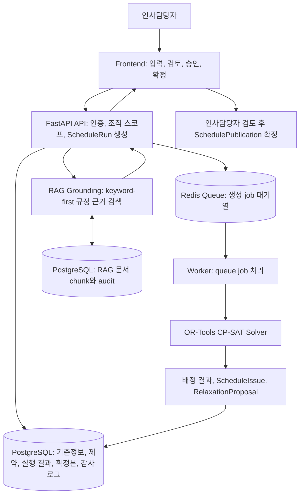

# WorkScheduleAI 제출 보고서

작성일: 2026-06-29

## 1. 프로젝트 목표

WorkScheduleAI의 목표는 인사담당자가 직원, 역할, 휴가, 상극 관계, 근무 규정을 반영해 근무표를 빠르게 생성하고, 시스템이 제시한 배정 결과와 예외 후보를 사람이 검토한 뒤 확정하도록 돕는 것입니다.

이 프로젝트는 "완전 자동 확정 시스템"이 아니라 "파일럿 운영 가능한 수준의 human-in-the-loop AI 스케줄링 시스템"을 목표로 합니다. 최종 책임과 맥락 판단은 인사담당자가 수행하고, 시스템은 제약 계산, 충돌 진단, 근거 제시, 감사 기록을 보조합니다.

## 2. 기획 배경

근무표 작성은 Excel 표를 채우는 작업처럼 보이지만 실제로는 제약 충돌 해결 문제입니다. 직원별 역할 가능 여부, 휴가, 출장, 교육, 개인 일정, 특정 직원 조합 금지, 근무량 공정성, 야간/주말 근무 검토, 운영 정책이 동시에 적용됩니다.

특히 근무표 결과는 직원 만족도와 운영 리스크에 직접 영향을 줍니다. AI가 결과를 자동 확정하는 방식보다, 어떤 제약 때문에 특정 배정이 어려웠는지와 어떤 예외 승인이 가능한지를 인사담당자가 이해하는 편이 더 중요합니다.

## 3. 시스템 구조

시스템은 크게 frontend, API, worker, PostgreSQL, Redis로 구성됩니다.

```text
React/Vite frontend
  -> FastAPI API
      -> PostgreSQL: 조직/직원/제약/결과/확정본/audit
      -> Redis: ScheduleRun job queue
      -> Worker: OR-Tools solver 실행
      -> RAG grounding: PostgreSQL 문서 chunk 기반 keyword-first 근거 검색
```

API는 사용자 요청을 받고 ScheduleRun을 생성합니다. Redis queue는 생성 작업을 worker로 전달합니다. Worker는 OR-Tools 기반 solver를 실행하고 결과, 이슈, 완화 후보를 DB에 저장합니다. Frontend는 polling으로 상태를 확인하고, 인사담당자가 결과를 검토, 수정, 확정할 수 있는 화면을 제공합니다.

아래 흐름도는 처음 보는 사람이 "입력부터 확정까지 데이터가 어디를 거치는지"를 한 번에 볼 수 있게 정리한 것입니다.



## 4. 주요 기능

관리자는 조직 기준정보를 구성합니다.

- 직원과 역할 등록
- 직원별 역할 가능 여부 설정
- 휴가, 출장, 교육, 개인 일정 등록
- 직원 간 blocked/avoid/prefer 조합 제약 등록
- 근무 유형과 역할별 필요 인원 설정
- 스케줄 정책과 warning override 관리

근무표 생성과 검토 흐름에는 다음 기능이 들어갑니다.

- 1일에서 31일 범위 ScheduleRun 생성
- Redis queue 기반 비동기 worker 처리
- OR-Tools CP-SAT 기반 배정
- 미배정 또는 충돌을 ScheduleIssue로 표시
- 휴가 override, manual review 등 RelaxationProposal 제시
- 예외 승인 후 재계산
- 수동 배정 검증과 저장
- 확정본 SchedulePublication 생성
- 확정본 Excel 다운로드
- audit log와 운영 metrics 확인

## 5. RAG 활용 방식

RAG는 근무표를 직접 생성하거나 정책을 자동 변경하지 않습니다. 현재 구현에서는 PostgreSQL에 저장된 조직별 문서 chunk를 keyword-first로 검색해 "판단 근거를 사람이 이해할 수 있게 보여주는 계층"으로 제한했습니다.

구현 방향은 다음과 같습니다.

- 조직별 문서 chunk를 tenant scope로 저장합니다.
- 기본 검색은 keyword-first입니다.
- evidence에는 문서 ID, chunk ID, 제목, 출처 유형, 확인일, confidence가 포함됩니다.
- prompt injection 문구가 있는 chunk는 drop합니다.
- 이메일, 전화번호, 주민등록번호 형태의 직접 식별자는 redaction합니다.
- RAG API가 SchedulePolicy, warning rule, solver input을 직접 변경하지 못하도록 테스트로 고정했습니다.
- hybrid retrieval은 `WORKSCHEDULEAI_RAG_HYBRID_RETRIEVAL=1`과 query embedding이 있을 때만 동작하는 후속 확장 경로입니다.

UI에서는 `RAG`, `chunk`, `confidence` 같은 구현 용어를 줄이고, 인사담당자가 이해하기 쉬운 "판단 근거", "근거 확인됨", "사내 운영 규정", "관련도" 같은 표현으로 바꿨습니다. 시연 대상자는 내부 retrieval 구조보다 "이 판단이 어떤 규정에 근거했는지"를 먼저 봐야 하기 때문입니다.

비용 관점에서도 현재 구현 범위를 분명히 나눴습니다. 근무표 계산은 solver가 맡고, ScheduleRun 설명은 기본적으로 server template fallback을 사용합니다. 현재 RAG는 keyword-first 근거 검색이며 외부 LLM provider 호출과 token cost tracking은 후속 확장입니다. 따라서 제출 범위의 설득 포인트는 "토큰으로 근무표를 생성한다"가 아니라, 구조화된 제약 계산과 근거 검색으로 인사담당자의 검토 시간을 줄이는 데 있습니다.

## 6. 근무표 생성 로직과 제약 반영

근무표 생성은 OR-Tools CP-SAT solver를 사용합니다. Solver input에는 직원, 역할, slot, requirement, 근무 불가 slot, blocked/avoid pair, 주간 상한, 연속 근무 제한, 최소 휴식, 야간/주말 제한, demand staffing target 등이 포함됩니다.

여기서 solver는 LLM처럼 문장을 생성하는 AI가 아닙니다. 근무표 문제를 수학적 탐색 문제로 바꾼 뒤, 가능한 배정 조합을 계산하는 엔진입니다. 이 프로젝트에서는 "직원 X를 slot Y의 role Z에 배정할 것인가"를 불리언 변수로 두고, 휴가자 제외, 역할 적격성, 상극 조합, 중복 배정 금지, 주간 상한 같은 규칙을 제약으로 넣습니다. 그 위에 미배정 최소화, 공정성, avoid pair 회피 같은 목표를 penalty로 더합니다.

Google OR-Tools CP-SAT는 constraint programming과 SAT 기반 탐색을 결합한 solver입니다. 정수와 불리언 변수로 표현되는 문제에 맞고, 직원 스케줄링처럼 "가능한 조합 중 규칙을 만족하는 해"를 찾아야 하는 문제에 적용하기 좋습니다. CP-SAT가 모든 운영 맥락을 자동 판단하는 것은 아니므로, 본 프로젝트는 solver 결과를 바로 확정하지 않고 ScheduleIssue와 RelaxationProposal을 인사담당자에게 보여준 뒤 사람이 확정하도록 설계했습니다.

제약은 성격에 따라 다르게 처리합니다.

- 역할 가능 여부와 휴가/불가 일정은 후보 배정에서 제외합니다.
- 같은 slot에서 한 직원이 여러 역할을 맡지 못하게 제한합니다.
- blocked pair는 같은 slot에 함께 배정되지 않게 제한합니다.
- avoid pair는 가능하면 피하도록 penalty로 반영합니다.
- 필요 인원을 채우지 못하면 solver 실패로 숨기지 않고 unfilled issue로 노출합니다.
- fairness와 반복 배정은 objective penalty로 반영합니다.
- solver가 optimal을 증명하지 못하고 feasible만 반환하면 "최적 보장 없음" 상태를 표현할 수 있게 했습니다.

이 설계가 중요한 이유는 실제 운영에서 제약의 성격이 서로 다르기 때문입니다. 모든 제약을 무조건 hard constraint로 만들면 해가 없을 때 아무 설명 없이 실패로 끝날 때가 있습니다. 모든 것을 soft constraint로 만들면 운영자가 승인하지 않은 예외가 자동으로 깨질 위험이 있습니다. 이 때문에 미배정과 완화 후보를 분리해 인사담당자가 검토하도록 설계했습니다.

## 7. 운영 안정성 개선 사항

운영 안정성을 위해 다음 개선을 반영했습니다.

- API와 worker를 분리해 solver 실행이 API 응답 경로를 막지 않게 했습니다.
- Redis queue payload에 `organization_id`를 포함해 worker 실행 전 tenant context를 설정할 수 있게 했습니다.
- Redis queue는 FIFO 방향을 맞추고, processing list와 lease metadata를 사용해 stale job recovery를 보강했습니다.
- ACK는 성공 또는 명시적 terminal 처리 후에만 수행하도록 조정해 infrastructure 예외에서 job을 잃지 않게 했습니다.
- production 환경에서는 `DATABASE_URL`, `REDIS_URL`, `WORKSCHEDULEAI_AUTH_REQUIRED`, actor secret, employee link secret이 없으면 startup을 실패시키는 fail-closed 정책을 적용했습니다.
- production에서 SQLite fallback이나 frontend localhost fallback이 조용히 동작하지 않게 했습니다.
- PostgreSQL RLS와 composite tenant FK로 tenant data isolation 방어층을 늘렸습니다.
- 확정본은 SchedulePublication snapshot으로 저장하고, 읽기 전용 잠금과 Excel export를 제공합니다.
- 수동 수정, 확정, notification, warning override 등은 audit log로 남깁니다.

## 8. 테스트 및 검증 결과

최근 전체 검증 결과는 다음 환경에서 확인했습니다.

- 검증일: 2026-06-29
- commit: `9300820`
- Python: `3.13.5`
- Node.js: `v24.13.0`
- npm: `11.8.0`

- `python -m pytest -q`: `365 passed, 2 skipped`
- frontend `npm test`: `19 passed`
- frontend `npm run build`: passed
- `git diff --check`: passed
- queue FIFO/lease 관련 targeted test: passed
- deployment config and public-doc guard tests: passed
- large schedule 기본 회귀: passed, hardening benchmark 일부는 opt-in 조건으로 skipped

남은 검증 공백도 명시적으로 남겨야 합니다.

- 실제 Railway API/worker/PostgreSQL/Redis/frontend staging smoke는 아직 별도 실행 대상입니다.
- `TEST_POSTGRES_URL`이 없어 PostgreSQL RLS integration signoff는 로컬에서 skipped였습니다.
- live Redis 서버를 붙인 통합 테스트는 실행하지 않았습니다.
- 원격 GitHub Actions 자체 실행은 로컬에서 확인하지 않았고, workflow 구조와 관련 테스트로 검토했습니다.

그래서 "테스트가 전부 끝난 상용 운영 제품"이 아니라 "로컬 통합 검증과 제출 시연 기준을 충족한 파일럿 후보"라고 표현하는 것이 정확합니다.

## 9. 주요 의사결정 기록

### 9.1 왜 완전 자동 확정이 아니라 human-in-the-loop인가

근무표는 휴가, 근로 조건, 팀 내 관계, 현장 예외 같은 맥락을 포함합니다. Solver가 수학적으로 가능한 배정을 찾더라도 조직 내 합의나 예외 승인 책임은 사람이 져야 합니다. 이 때문에 시스템은 결과를 자동 확정하지 않고, 이슈와 근거, 완화안을 제시한 뒤 인사담당자가 검토하고 확정하도록 설계했습니다.

### 9.2 왜 API, worker, frontend를 분리했는가

근무표 생성은 입력 크기와 제약 수에 따라 오래 걸릴 때가 있습니다. API 프로세스에서 직접 solver를 실행하면 요청 timeout, 배포 재시작, 사용자 응답성 문제가 커집니다. 별도 worker는 API를 가볍게 유지하고, queue lease/recovery로 작업 손실과 중복 처리 위험을 관리합니다. Frontend는 API 상태를 polling해 사용자에게 진행 상태를 보여줍니다.

### 9.3 왜 OR-Tools CP-SAT를 선택했는가

근무표 생성은 자연어 생성보다 조합 최적화에 가깝습니다. 직원, 날짜, 근무 슬롯, 역할을 조합하고, 각 조합이 휴가, 역할 적격성, 상극 관계, 근무량 제한을 만족하는지 계산해야 합니다. OR-Tools CP-SAT는 이런 문제를 불리언/정수 변수와 제약으로 모델링하기에 맞습니다.

순수 LLM 방식은 후보 설명에는 도움이 되지만, 모든 제약을 빠짐없이 지켰는지 보장하기 어렵습니다. 단순 greedy rule engine은 구현 규모는 작지만, 여러 제약이 동시에 충돌할 때 더 나은 후보를 찾기 어렵습니다. 외부 최적화 SaaS나 별도 solver 플랫폼은 초기 파일럿에 비해 운영 의존성과 배포 복잡도가 커집니다.

OR-Tools CP-SAT는 Python backend 안에 직접 넣고, 제한 시간, seed, feasible/optimal 상태, objective penalty를 명시적으로 다룹니다. "자동 확정"이 아니라 "계산 가능한 후보와 충돌 근거를 만들고 사람이 확정하는" 현재 목표에 맞았습니다. 단, 큰 고제약 운영 데이터에서는 탐색 시간이 늘어나므로 worker 분리, timeout, 미배정 이슈 노출, 후속 benchmark를 함께 둔 것이 전제입니다.

### 9.4 왜 Redis queue, PostgreSQL, Railway 구조를 사용했는가

PostgreSQL은 tenant 데이터, 확정본 snapshot, audit log, RLS, composite FK 같은 영속성과 격리 기능에 적합합니다. Redis는 ScheduleRun 같은 비동기 작업 큐에 적합하고, processing list와 lease metadata로 worker 장애 복구를 다룹니다. Railway는 API, worker, frontend, PostgreSQL, Redis를 서비스 단위로 분리해 파일럿 배포 구조를 만들기 쉽습니다.

### 9.5 왜 운영 설정 fail-closed를 넣었는가

운영 환경에서 `DATABASE_URL`이 빠져 SQLite로 떨어지거나, frontend가 localhost API를 호출하거나, 인증 secret이 약한 상태로 배포되면 시연은 되는 것처럼 보여도 데이터 손실 또는 보안 위험이 커집니다. production 환경에서는 필수 설정이 없거나 약할 때 startup을 실패시키는 쪽이 안전합니다.

### 9.6 왜 RAG 근거를 인사담당자 친화적으로 다듬었는가

인사담당자는 retrieval mode나 chunk ID 자체보다 "어떤 사내 규정 때문에 이 판단이 나왔는지"를 알아야 합니다. 그래서 내부 구현 용어를 줄이고, 판단 근거, 사내 운영 규정, 관련도, 안전 메모처럼 검토자가 바로 이해할 수 있는 표현을 사용했습니다.

### 9.7 왜 토큰 비용은 후속 검증 항목으로 두었는가

인사담당자와 회사 대표가 보는 비용은 LLM token 사용료만이 아닙니다. 근무표 작성 시간, 휴가 반영 누락, 상극 조합 누락, 불공정 배정 민원, 예외 승인 기록 부재도 운영 비용입니다. 현재 구현은 solver가 배정 계산을 맡고, server template 설명과 keyword-first RAG 근거 검색으로 검토 부담을 줄이는 구조입니다.

외부 LLM provider를 연결한다면 토큰 비용은 "근무표를 생성하는 비용"이 아니라 "검토와 설명 시간을 줄이는 비용"으로 검증해야 합니다. 그 단계에서는 조직별 LLM 호출 수, token usage, estimated cost, 월간 사용 한도, cache hit rate를 남겨 실제 절감된 검토 시간과 비교해야 합니다. 파일럿 제출 범위에서는 LLM provider와 cost tracking을 구현된 핵심 기능처럼 설명하지 않는 것이 더 정확합니다.

### 9.8 왜 LangChain 같은 orchestration 도구를 바로 붙이지 않았는가

LangChain이나 LangSmith 계열 도구는 복잡한 chain 구성, tracing, evaluation, 비용 관측에 도움이 됩니다. 현재 범위에서는 solver 중심 구조, server template fallback, keyword-first RAG 근거 검색을 먼저 안정화하는 것이 더 중요했습니다. 외부 orchestration 계층을 먼저 붙이면 파일럿 제출 범위에 비해 의존성과 설명 복잡도가 커집니다.

후속 단계에서 LLM provider를 실제 연결한다면 먼저 provider-agnostic한 usage log와 비용 집계를 남기는 편이 단순합니다. 이후 LLM 호출 경로가 늘어나거나 prompt/evaluation 관리가 복잡해지면 LangChain 또는 유사 도구를 검토합니다.

### 9.9 왜 queue ACK/lease/recovery를 보강했는가

Worker가 DB 연결 실패나 tenant context 설정 실패 중에도 ACK하면 Redis processing list에서 job이 사라져 재처리가 어려워집니다. worker가 죽은 job을 영원히 processing list에 남겨도 stuck 상태가 됩니다. FIFO, lease, stale recovery, ACK 조건을 보강한 이유는 파일럿 운영에서 생성 작업의 손실과 오래된 worker 결과를 줄이기 위해서입니다.

### 9.10 왜 "파일럿 운영 가능한 수준"이라고 표현하는가

현재 시스템은 핵심 vertical slice, 문서화, 로컬 테스트, 배포 설정을 갖췄지만 공개 SaaS 운영에 필요한 모든 계정 생명주기, 실제 staging smoke, production RLS signoff, 운영 모니터링, 장애 대응 자동화가 완료된 것은 아닙니다. 이 때문에 "실제 운영 가능"보다 "통제된 파일럿 운영과 제출 시연에 적합한 수준"이라고 말하는 것이 방어 가능한 표현입니다.

## 10. 한계점

- 공개 회원가입과 self-service onboarding은 아직 release gate입니다.
- 비밀번호 초기 설정/재설정, 키 회전, rate limit, abuse 대응은 후속 범위입니다.
- 일반 직원의 휴가/일정 요청 self-service는 부분 기반만 있고 완성 범위가 아닙니다.
- 알림은 provider contract와 일부 dispatch 흐름이 있으나 운영 재시도, 모니터링, 직원별 destination 관리는 더 필요합니다.
- RAG는 근거 제시용이며 법률 판단 또는 정책 자동 수정 기능이 아닙니다.
- LLM provider 연결, token usage, estimated cost, 월간 한도, cache hit rate 추적은 아직 구현되지 않았습니다.
- 법정 근로시간 자동 보증, 급여 계산, 외부 HR 실시간 연동은 범위 밖입니다.
- 100명/31일 고제약 운영 데이터 성능은 opt-in benchmark와 후속 hardening 대상입니다.

## 11. 향후 개선 방향

- Railway staging에서 실제 API, worker, PostgreSQL, Redis, frontend end-to-end smoke 자동화
- PostgreSQL RLS integration test를 release signoff에 포함
- pgvector 기반 RAG 검색, 서버 측 embedding 생성/backfill, 장기 citation 평가셋 CI 편입
- 후속 LLM provider 연결 시 usage audit, token cost 추적, 조직별 월간 사용 한도, cache 전략
- 관리자 owner onboarding, 멤버십 matrix, 비밀번호 재설정, 키 회전 운영 절차 구현
- 직원 self-service 요청과 승인 workflow 고도화
- notification retry, failure monitoring, Slack/email destination 관리
- 장기 fairness 집계를 snapshot JSON 파싱에서 aggregate table로 전환
- 한국형 warning rule과 override UX 세분화
- 실제 운영 데이터 기반 solver 성능 hardening

## 12. 결론

WorkScheduleAI는 제약 최적화와 RAG 근거 제시를 결합해 인사담당자의 근무표 작성과 검토를 돕는 시스템입니다. 핵심 가치는 근무표를 AI가 일방적으로 확정하는 데 있지 않고, 제약 충돌과 예외 후보를 설명 가능한 형태로 드러내어 사람이 안전하게 판단하도록 돕는 데 있습니다.

비용 관점에서도 같은 원칙을 따릅니다. 현재 제출 범위에서 근무표 계산은 토큰이 아니라 solver와 서버 로직이 담당합니다. 후속으로 LLM provider를 연결한다면 사용량과 비용을 계량해 실제 절감된 인사담당자 시간과 비교해야 합니다.

현재 산출물은 제출 시연과 통제된 파일럿 검증에 적합한 수준입니다. 공개 상용 서비스로 확장하려면 실제 Railway staging 검증, PostgreSQL RLS signoff, 인증/온보딩/운영 모니터링 강화를 추가해야 합니다.

## 13. 조사 레퍼런스와 적용 이유

기획 단계에서는 직접 구현할 기능과 후속 범위를 나누기 위해 직원 스케줄링, 제약 최적화, worker queue, tenant isolation 관련 문서를 함께 봤습니다.

- [Google OR-Tools Constraint Optimization](https://developers.google.com/optimization/cp): CP-SAT가 scheduling 문제에 적합한 constraint programming solver임을 확인했습니다. 이 자료를 보고 근무표 생성을 LLM 생성이 아니라 제약 최적화 문제로 분리했습니다.
- [Google OR-Tools Employee Scheduling](https://developers.google.com/optimization/scheduling/employee_scheduling): 직원 스케줄링을 CP-SAT 예제로 푸는 방식을 참고했습니다. 직원-일자-근무 슬롯을 변수로 보고, 조건을 제약으로 모델링하는 방향을 잡는 데 도움이 됐습니다.
- [Google OR-Tools CP-SAT Solver](https://developers.google.com/optimization/cp/cp_solver): CP-SAT가 정수 변수 기반으로 동작한다는 점을 확인했습니다. 그래서 근무 배정 여부를 불리언 변수로 두고, penalty도 정수 가중치로 다루는 구조를 선택했습니다.
- [Timefold Employee Shift Scheduling Constraints](https://docs.timefold.ai/employee-shift-scheduling/latest/user-guide/constraints): hard/medium/soft constraint와 score 개념을 참고했습니다. 이 프로젝트에서도 절대 금지, 승인 필요, 가능하면 회피할 제약을 구분해 설명했습니다.
- [Railway Workers and Queues](https://docs.railway.com/guides/cron-workers-queues): API와 worker를 분리하고 Redis queue를 공유하는 배포 구성을 참고했습니다. Solver 실행을 API 요청 경로에서 분리한 결정의 근거입니다.
- [PostgreSQL Row Security Policies](https://www.postgresql.org/docs/current/ddl-rowsecurity.html): tenant row isolation을 위한 RLS 방어층을 설계할 때 참고했습니다. 애플리케이션 레벨 조직 필터만 믿지 않고 DB 레벨 방어를 함께 둔 이유입니다.

## 참고 문서

- `README.md`
- `docs/README.md`
- `docs/contracts/openapi.m0.json`
- `docs/contracts/schedule-run-state-machine.md`
- `docs/contracts/xlsx-import-contract.md`
- `docs/contracts/fixtures/*.json`
